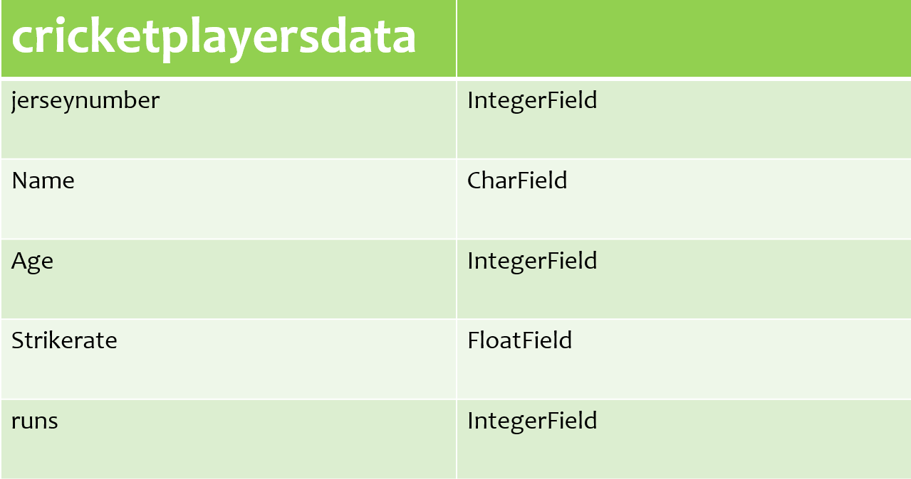
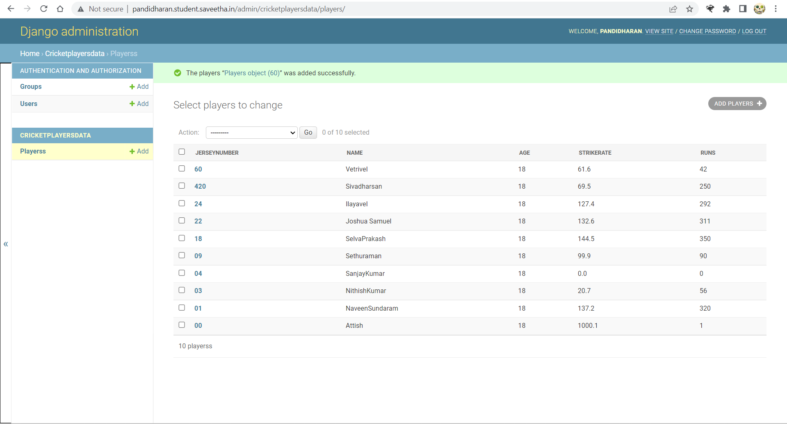

# Django ORM Web Application

## AIM
To develop a Django application to store and retrieve data from a database using Object Relational Mapping(ORM).

## Entity Relationship Diagram

## DESIGN STEPS

### STEP 1:

An Django application is created inside dataproject folder.

### STEP 2:

A python program is written to create a table to store and retrieve data.

The table is created with 4 fields in which on of the field is PrimaryKey.

Then the project files migrated. A superuser is also created.

### STEP 3:

Now the server side program is executed .

The admin page of our website is accessed using username and password.

Records are added and saved in the table inside the database.

## PROGRAM
~~~
from django.db import models
from django.contrib import admin

class Players(models.Model):
    jerseynumber=models.CharField(max_length=10,primary_key=True)
    name=models.CharField(max_length=100)
    age=models.IntegerField()
    strikerate=models.FloatField()
    runs=models.IntegerField()

class PlayersAdmin(admin.ModelAdmin):
    list_display=('jerseynumber','name','age','strikerate','runs')
~~~
## OUTPUT

## RESULT
Thus a Django application is successfully developed to store and retrieve data from a database using Object Relational Mapping(ORM).
